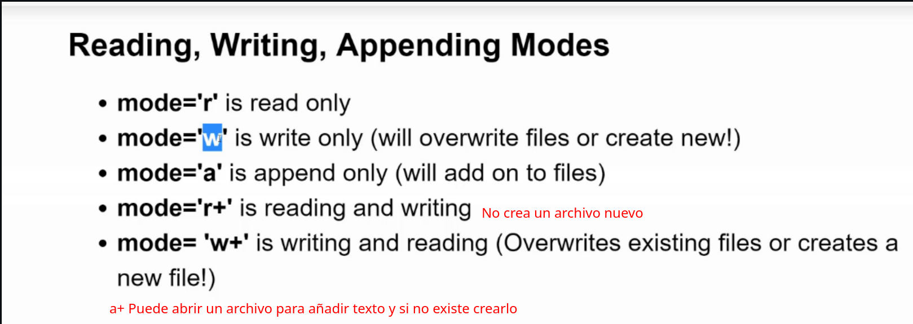

- [Course from zero to Hero - Udemy -](#course-from-zero-to-hero---udemy--)
  - [by Jose Portilla](#by-jose-portilla)
  - [by Andrei Neagoie](#by-andrei-neagoie)
- [Instalación de Python y SetUp](#instalación-de-python-y-setup)
  - [Instalación](#instalación)
  - [Instalamos el tema para Jupyter](#instalamos-el-tema-para-jupyter)
- [Introducción a Python](#introducción-a-python)
  - [Usos de python y librerías](#usos-de-python-y-librerías)
  - [Crear comentarios en Pyhon](#crear-comentarios-en-pyhon)
  - [Fundamental Data Types](#fundamental-data-types)
    - [**Algunas operaciones**](#algunas-operaciones)
      - [potencias](#potencias)
      - [Parte entera de una división decimal](#parte-entera-de-una-división-decimal)
      - [Resto de una división entera](#resto-de-una-división-entera)
    - [Funciones matemáticas](#funciones-matemáticas)
      - [**round**](#round)
      - [**abs**](#abs)
      - [**bin / int**](#bin--int)
  - [Uso de variables](#uso-de-variables)
  - [Uso del método print()](#uso-del-método-print)
  - [Ordered vs unordered](#ordered-vs-unordered)
  - [String](#string)
    - [**Propiedades de los strings**](#propiedades-de-los-strings)
    - [**Métodos de los strings**](#métodos-de-los-strings)
      - [**Slicing**](#slicing)
      - [**strip()**](#strip)
      - [**upper() lower() split()**](#upper-lower-split)
      - [**format**](#format)
        - [Float formatting](#float-formatting)
        - [f-string = formated string literal](#f-string--formated-string-literal)
      - [**Casefold**](#casefold)
      - [**find**](#find)
      - [**Capitalize**](#capitalize)
      - [**replace**](#replace)
      - [generar el alfabeto (inglés)](#generar-el-alfabeto-inglés)
  - [List - (data structure)](#list---data-structure)
    - [**Métodos**](#métodos)
      - [**len()**](#len)
      - [**Slicing**](#slicing-1)
      - [**Append() pop()**](#append-pop)
      - [**remove(element_value)**](#removeelement_value)
      - [**clear()**](#clear)
      - [**insert(index,value)**](#insertindexvalue)
      - [**extend([])**](#extend)
      - [**Sort() sorted() reverse()**](#sort-sorted-reverse)
      - [**Lista de elementos**](#lista-de-elementos)
      - [**Count()**](#count)
      - [**All() any()**](#all-any)
      - [**Join()**](#join)
      - [**Index(value,start,stop) / in **](#indexvaluestartstop--in-)
      - [**copy**](#copy)
      - [**List unpacking**](#list-unpacking)
  - [Dictionaries - dict (data structure)](#dictionaries---dict-data-structure)
    - [**Métodos**](#métodos-1)
      - [get()](#get)
      - [**keys() / values() / items()**](#keys--values--items)
      - [**clear()**](#clear-1)
      - [**copy()**](#copy-1)
      - [**pop()**](#pop)
      - [**update()**](#update)
  - [Tuples - data structure -](#tuples---data-structure--)
    - [**Métodos**](#métodos-2)
      - [**Count() / index()**](#count--index)
      - [**Sum()**](#sum)
  - [Sets - data structure -](#sets---data-structure--)
    - [**Métodos**](#métodos-3)
      - [**Add()**](#add)
      - [**clear() / copy()**](#clear--copy)
      - [difference()](#difference)
      - [discard()](#discard)
      - [difference_update()](#difference_update)
      - [intersection() o &](#intersection-o-)
      - [isdisjoint()](#isdisjoint)
      - [union() o  |](#union-o--)
      - [issuperset()](#issuperset)
      - [**Issubset()**](#issubset)
- [Python Modules](#python-modules)
  - [Python Collections Module](#python-collections-module)
    - [Counter](#counter)
      - [Métodos](#métodos-4)
        - [elements()](#elements)
        - [most_common()](#most_common)
        - [substract([iterable-or-mapping])](#substractiterable-or-mapping)
    - [defaultdict](#defaultdict)
    - [OrderedDict](#ordereddict)
- [In/Out with basic Files](#inout-with-basic-files)
  - [Crear un fichero - %%writefile](#crear-un-fichero---writefile)
  - [Abrir el fichero - open()](#abrir-el-fichero---open)
  - [Leer el fichero - .read()](#leer-el-fichero---read)
  - [seek()](#seek)
  - [readlines()](#readlines)
  - [close()](#close)
  - [With...as](#withas)
  - [open() - extendido](#open---extendido)
    - [**'a' (append) mode**](#a-append-mode)
    - [**w (write) mode**](#w-write-mode)
  - [File location](#file-location)
- [Operadores](#operadores)
  - [Aritméticos](#aritméticos)
  - [Asignación](#asignación)
  - [Comparación](#comparación)
  - [Lógicos](#lógicos)
  - [Identidad](#identidad)
  - [is vs '=='](#is-vs-)
    - [==](#)
    - [is](#is)
- [Condicionales e Iteraciones](#condicionales-e-iteraciones)
  - [If -elif-else statement](#if--elif-else-statement)
    - [**Ternary operator**](#ternary-operator)
  - [For loops](#for-loops)
    - [**While not**](#while-not)
  - [Keywords importantes en los loops](#keywords-importantes-en-los-loops)
    - [**Pass**](#pass)
    - [**Continue**](#continue)
    - [**Break**](#break)
- [Useful operators](#useful-operators)
  - [Range()](#range)
  - [enumerate()](#enumerate)
  - [zip()](#zip)
  - [In / not in](#in--not-in)
  - [Min() max()](#min-max)
  - [Random library](#random-library)
    - [**shuffle**](#shuffle)
    - [Randint](#randint)
  - [**Input**](#input)
    - [Validación input](#validación-input)
- [Methods and Functions](#methods-and-functions)
  - [Métodos](#métodos-5)
    - [**Argumentos vs parámetros**](#argumentos-vs-parámetros)
    - [**Tipos de argumentos**](#tipos-de-argumentos)
  - [Argumentos *args (arguments) /  **kwargs(keywords arguments)](#argumentos-args-arguments---kwargskeywords-arguments)
      - [*args](#args)
      - [**kwargs(keywords arguments)](#kwargskeywords-arguments)
- [Scoope](#scoope)
  - [LEGB Rule](#legb-rule)
  - [global keyword](#global-keyword)
  - [nonlocal keyword](#nonlocal-keyword)
- [Map(func,iterable)](#mapfunciterable)
- [Filter(function, iterable)](#filterfunction-iterable)
- [Lambda](#lambda)
- [OOP - Object Oriented Programming](#oop---object-oriented-programming)
  - [Creación de una clase](#creación-de-una-clase)
  - [Añadimos los métodos](#añadimos-los-métodos)
    - [constructor __init__](#constructor-init)

# Course from zero to Hero - Udemy -

## by Jose Portilla

> <span style="font-size:1.5em;"> [_link del curso_](https://www.udemy.com/course/complete-python-bootcamp/) </span>  
 
## by Andrei Neagoie

> <span style="font-size:1.5em;"> [_link del curso_](https://www.udemy.com/course/complete-python-developer-zero-to-mastery/) </span>
# Instalación de Python y SetUp

## Instalación

Bajaremos un paqueta q se llama anaconda compuesto por python y una serie de librerías útiles junto con editores de texto como Jupiter. Lo bajamos desde

<span style="font-size:1em;">[_link anaconda.com_](https://www.anaconda.com/distribution/)</span>

1. Vamos a en nuestro direcotrio
2. Ejecutamos el archivo descargado en el link

   ```
     bash Anaconda3-5.2.0-Linux-x86_64.sh
   ```

   ```
     source .bashrc
   ```

3. Comprobamos que se ha instalado adecuadamente  
   
4. Lanzamos interfaz gráfica de Anaconda

   ```
       anaconda-navigator
   ```

5. Para ver info de anaconda

   ```
       conda info
   ```


6. Vemos como en el prompt pone base eso es xq es el interprete de anaconda para desactivarlo

   ```
     conda deactivate
   ```

   para volverla a activar

   ```
    conda activate
   ```

1. Saber versión y donde está instalado python  
   
1. Añadir PYTHONPATH
   Abrir en nuestra carpeta personal el archivo .bashrc y al final del archivo añadir lo q nos devuelve which python

   

1. Ahora cuando tecleamos

   

Y nos tiene q dar la misma respuesta.

## Instalamos el tema para Jupyter

Source https://github.com/dunovank/jupyter-themes
https://medium.com/@rbmsingh/making-jupyter-dark-mode-great-5adaedd814db

1. actualizamos anaconda

   ```
   conda update anaconda
   ```

2. instalamos los temas
   ```
     pip install jupyterthemes
   ```
   ```
     pip install --upgrade jupyterthemes
   ```
3. Seleccionamos monokai  
   
4. Modificamos el tema
   Con esa modificación los ejes de los gráficos se ven mal para rectificarlo:
   Make a file named 00_startup.py in ~/.ipython/profile_default/startup and stick the following snippet into it, and restart Jupyter, details are here
   import os
   import pandas as pd
   import numpy as np
   import matplotlib.pyplot as plt
   import seaborn as sns
   from jupyterthemes import jtplot
   jtplot.style(theme=’monokai’, context=’notebook’, ticks=True, grid=False)

# Introducción a Python

## Usos de python y librerías


Para poder ejectar código python necesitamos un intérprete que lee línea a línea nuestro código y una viertual machine. Si lo bajamos de la web oficial ambos estarán escritos en C por eso se llama c-virtual machine y cpython. 


## Crear comentarios en Pyhon

```python
  # comentario monolínea
  '''
    comentario de bloque
  '''
```
Las 3 comillas tb pueden servir para escribit un string de múltiples líneas, así q lo adecuado en py para comentarios de múltiples líneas es usar # antes de cada una

## Fundamental Data Types
Son los tipos especificados en el core de python tales como :  


Tenemos otros tipos de datos como:  

- ### **Custom Types - Class**
  Podemos crear nuestros propios tipos de datos, para ello construimos clases.
- ### **Specialized Data Type**
  Son aquellos que están especificados en paquetes externos, los llamados `modules`.
- ### **None - type**
    Indica ausencia de valor

### **Algunas operaciones**

#### potencias

```python
      # para hacer potencias de un número
      print(2**3) # 8
```
#### Parte entera de una división decimal
```python
      # Para obtener la parte entera de una división decimal //

      print(2//4 ) # 0 => 0.5
      print(5//4 ) #  1  =>1.25
```

#### Resto de una división entera
```python
      # Para obtener el resto de la división entera es el módulo %

      print(5 % 4) # 1
      print(6 % 4 )# 2
```

### Funciones matemáticas

#### **round**
Permite redondear el número  

```python
    round(3.1) # 3
    round(3.9) # 4
```
#### **abs**
Obtener el valor absolute de un valor

```python
    abs(3)  # 3 
    abs(-3) # 3 
```
#### **bin / int**

representación binaria bin() 

```python
    bin(5) # '0b101'
```
Pasar un número en base 'x' a integer (base 10). 
El método funciona como: este número '0b101' en base 2 (binaria) pásalo a int

```python
    int('0b101', 2) # 5
``` 
## Uso de variables

Hay q tener claro que en python no hay tipos primitivos, todo el python son objetos!

Python usa tipado dinámico como JavaScript esto significa que no es necesario especificar el tipo de dato que contendrá dicha variable.
Por ejemplo Java tiene un tipado estático porque requiere que especifiquemos durante la declaración el tipo de dato que contendrá la variable.  
 Podemos usar `type()` para saber el tipo de variable  
 Usamos la función `str()` para **castear** a string, lo que llamamos `type conversion`. Podemos usar `int()` `float()` `bool` ...

```python
  # Tipado dinámico

  my_dogs = 2

  print('tipo de mi variable ' + str(type(my_dogs))) # tipo de mi variable <class 'int'>

  my_dogs = ['sammy','frankie']

  print('mi variable ha cambiado de tipo, ahora es una list ' + str(type(my_dogs)) +' -> ' +str(my_dogs))
  # mi variable ha cambiado de tipo, ahora es una list <class 'list'> -> ['sammy', 'frankie']

  # type conversion

  number = 5
  name = 'david'
  print(name+number) # eso da error
  print(name+str(number))
```

## Uso del método print()

Para imprimir contenido usamos el método print(), éste acepta un atributo para indicar que no haga salto de página end=’’.

```python
  for x in range(10):
    print(x, end='')

  # 0123456789
```

## Ordered vs unordered

Por ejemplo una `list` es un objeto **ordenado** y un `dict` es un objeto **desordenado** (en python todo son objetos). El concepto ordenado/desordenado hace referencia a como se almacena la info en memoria.
Los elementos de una lista se guardan en memoria uno al lado del otro tal como los vamos especificando, pero n una dict los elementos se guardan en diferentes puntos de la memoria. Si hacemos un dict pequeño   

```python      
      user = {
        'nombre':'dabid', 
        'edad':36
      }
```
y lo imprimimos probablemente los campos se impriman cn ese orden pero diccionarios de mayor tamaño muy probablemente los campos se presenten en distinto orden.  


## String

Funcionan como arrays así que usando el índice podemos extraer letras del string.
Está habilitado el reverse index(indice reverso) así sin conocer la longitud del string podemos extraer el último carácter(poner el índice en negativo: -1).

```python
  my_name = "david"
  my_name[0] # 'd'
  my_name[1] # 'a'
  # len() function

  print('utilizando la función len() => '+my_name[len(my_name)-1])

  # utilizando la función len() => d

  # última letra sin saber la longitud del str

  # Reverse index

  print('utilizando el indice reverso => '+my_name[-1])
  #utilizando el indice reverso => d
```

Tamaño de un str usamos la función len()

### **Propiedades de los strings**

- 1. Son inmutables, no podemos modificar un string

     ```python
       name = 'David'
       name[0]= 'P'

       # 'str' object does not support item assignment por lo tanto strings inmutables
     ```

- 2. Concatenables, solo funciona con strings no le puedo concatenar un número, para ello debo castearlo a `str` previamente

     ```python
       x = "hello world"

       y = ' is beatifull outside'

       x+= y
       print(x) #hello world is beatifull outside

       name = 'David'

       name = 'P'+ name[1:]
       name #'Pavid'

       number = 5
       name = 'david'
       print(name+number) # eso da error 
       print(name+str(number)) # david5

     ```

- 3. Multiplicables

     ```python
      name = 'd'

      name\*10 # dddddddddddd

     ```

### **Métodos de los strings**

#### **Slicing**

- [start:stop:step] nos permite obtener un subString  
   stop - indica hasta dnd se extrae pero sin incluir ese caracter  
   step - divide en str en grupos de X carcateres y nos devuelve el
  primer caracter de cada grupo

  ```python
    # slicing [start:stop:step]

        my_string = "abcdefghijk"

        print(' substring desde el índice 0 hasta el final [::] => '+my_string[::])
        print(' substring desde el índice 2 hasta el final => '+my_string[2:])
        print(' substring desde el índice 0 hasta el índice 3 (NO incluido)) => '+my_string[:3])
        print(' substring desde el índice 2 hasta al 5(No incluido) => '+my_string[2:5])

        # uso del tercer parámetro, divide en str en grupos de X carcateres y nos devuelve el primer caracter de cada grupo

        # por ejemplo si ponemos 2 ab - cd - ef - gh - ij - k null

        print(' substring dividido en grupos de a 2 => '+my_string[::2])

        # por ejemplo si ponemos 3 abc - def - ghi - jk null

        print(' substring dividido en grupos de a 3 => '+my_string[::3])

        # lo mismo pero de un subString cd - ef

        print(' substring del 2 al 5 dividido en grupos de a 2 => '+my_string[2:6:2])

        # utilizando el 3 como negativo -1 invierte el string kjihgfedcba

        print('separador de grupo en - empieza por el final(INVIERTE EL STRING) => '+my_string[::-1])

        # utilizando el 3 como negativo -1 Ab - Cd - Ef - Gh - Ij - K null <-

        print(' usando el separador de grupo en - empieza a contar por el final=> '+my_string[::-2])

        '''
            substring desde el índice 0 hasta el final [::]              => abcdefghijk
            substring desde el índice 2 hasta el final                   =>   cdefghijk
            substring desde el índice 0 hasta el índice 3 (NO incluido)) => abc
            substring desde el índice 2 hasta al 5(No incluido)          =>   cde
            substring dividido en grupos de a 2                          => acegik
            substring dividido en grupos de a 3                          => adgj
            substring  del 2 al 5 dividido en grupos de a 2               => ce
            separador de grupo en - empieza por el final(INVIERTE EL STRING) => kjihgfedcba
            usando el separador de grupo en - empieza a contar por el final=> kigeca
        '''
  ```
#### **strip()**
Permite eliminar los espacios en blanco por delante y detrás de un string. Puede aceptar como argumento los caracteres a eliminar 

```python
string = '  xoxo love xoxo   '

# eliminamos los espacios en blanco
print(string.strip()) # xoxo love xoxo

# los siguientes caracteres serán eliminados
#  <whitespace>,x,o,e 
print(string.strip(' xoe'))  #lov

# el argumento no contiene espacios en blanco 
#ni ningún otro caracter coincidente en el string
# así q el string se mantiene igual
print(string.strip('stx')) #  xoxo love xoxo 

string = 'android is awesome'
print(string.strip('an')) # droid is awesome

```

#### **upper() lower() split()**

```python
    x = "hi this is a string"
    print(x.upper()) #HI THIS IS A STRING
    print(x.lower()) #hi this is a string
    print(x.split()) #['hi', 'this', 'is', 'a', 'string']
    print(x.split('i')) #['h', ' th', 's ', 's a str', 'ng']
```

#### **format**

```python
print('hello {}'.format('world')) #hello world

name= 'David'
apellido1 = 'Martin'
apellido2 = 'Vergues'

print('me llamo {} {} {}'.format('David', 'Martin', 'Vergues'))
#me llamo David Martin Vergues

print('me llamo {2} {1}, {0}'.format('David', 'Martín', 'Vergues'))
#me llamo Vergues Martín, David

#podemos especificar el número de caracteres q ocupara cada string y si cómo estará alineado

print('alineación: {0:<15} {1:^15} {2:>15}'.format('izq', 'centro', 'drcha'))
# izq                 centro                drcha
# 0 el primer valor 'izq'
# < indica hacia la izq
# 15 número de esacios a ocupar

print('alineación: {0:=<15} {1:-^15} {2:.>15}'.format('izq', 'centro', 'drcha'))
# alineación: izq============ ----centro----- ..........drcha

#podemos usar keyword
print('me llamo {v} {m}, {d}'.format(d='David', m='Martín', v='Vergues'))
#me llamo Vergues Martín, David

#podemos usar referencias a variables
print('me llamo {2} {1}, {0} y tengo {3}'.format(name,apellido1,apellido2, '35'))
#me llamo Vergues Martin, David y tengo 35

#podemos truncar los strings con la notación del punto
print('me llamo {0:.3} '.format(name)) #me llamo Dav
```
* 
  ##### Float formatting
  {value:width.precision f}  
   Value => ponemos el valor del número  
   Width => tamaño que ocupará el número hecho string (nº de caracteres)  
   Precision => número de decimales que tendrá

    ```python
    result = 1.2987012987012987

    print('mi valor es {r:1.3f}'.format(r=result))
    #mi valor es 1.299
    print('mi valor es {r:10.3f}'.format(r=result))
    #mi valor es      1.299
    ```
* 
  ##### f-string = formated string literal
  
    ```python
    name = "David"
    age = 3
    print(f'hello, his name is {name} and he is {age} years old')
    # hello, his name is David and he is 3 years old

    result = 1.459029
    result2 = 1.45

    print(f'este es mi resultado => {result:1.2f}')
    # este es mi resultado => 1.46

    print(f'este es mi resultado => {result2:1.4f}')
    # con notación de .format() este es mi resultado => 1.4500

    print(f'este es mi resultado => {result2:<{10}.{3}}')
    # con notación de f-string este es mi resultado =>  1.45

    print(f'este es mi resultado => {result2:^{10}.{3}}')
    # con notación de f-string este es mi resultado =>    1.45
    ```
    {3} En este caso hace referencia al número total de dígitos que tendrá el número, no como en .format() que hace referencia al número de dígitos decimales

#### **Casefold**
- Es como un equalsIgnoreCase de java, elimina las distinciones entre mayúsculas y minúsculas en el momento de comparar strings.
    ```python
      str1 = 'david'
      str2 = 'DAVID'

      if str1 == str2:
        print('son iguales')
      else:
        print('son diferentes')
      # son diferentes
    ```
  usando casefold()
    ```python
      str1 = 'david'
      str2 = 'DAVID'

      if str1 == str2.casefold():
        print('son iguales')
      else:
        print('son diferentes')
      # son iguales
    ```
#### **find**
- Sólo funciona en estrings, para saber si un string contiene a otro y si lo está nos devuelve la posición y si no un -1. Hace distinción entra minusculas y mayúsculas.
    ```python
      str1 = 'david'
      str2 = 'hello david'

      str2.find(str1) #6
      str2.find('ello') #1
      str2.find('Hello') #-1
    ```
#### **Capitalize**
- La primera letra de una palabra en mayúscula.
    ```python
      def old_macdonald(name):
          first_part = name[:3]
          second_part = name[3:]

          return first_part.capitalize()+second_part.capitalize()

      old_macdonald('macdonald') #'MacDonald'
    ```
#### **replace**
- reemplazar partes del texto.

```python
       quote= 'to be or not to be'
       print(quote.replace('be','me'))
       # to me or not to me
```
#### generar el alfabeto (inglés)

importamos la librerio string

```python
import string

string.ascii_lowercase
#'abcdefghijklmnopqrstuvwxyz'
```
`Aplicando todos estos métodos sobre un string nunca alteramos el string original, son inmutables!, pero podemos asignar el resultado a una nueva variable`

## List - (data structure)

Secuencia ordenada de elementos que pueden ser de diferentes tipos(numbers, string,obj...). Podemos tener distintos tipos de datos almacenados en un list.  

### **Métodos**

#### **len()**
- Conocer el número de elementos de la list.  

```python
    my_List = []

    my_List = ['string', 100, 20.3,1,2,3]

    # len()
    len(my_List)
```
#### **Slicing**

- [start:stop:step]  
  Funciona igual que en los strings. No altera el array original pero devuelve un nuevo array.

```python
    my_List[-1]     # 3
    my_List[4:]     #  [2, 3]
    my_List[:3]     #  ['string', 100, 20.3]
    my_List[::2]    #  ['string', 20.3, 2]
    my_List*2       # ['string', 100, 20.3, 1, 2, 3, 'string', 100, 20.3, 1, 2, 3]
```

  Podemos concatenar list sumándolas

```python
    my_list_1 = [1,2,3,4,5]
    my_list_2 = [6,7,8,9,10]

    my_list_1+=my_list_2

    my_list_2 # [6, 7, 8, 9, 10]
    my_list_1 # [1, 2, 3, 4, 5, 6, 7, 8, 9, 10]
```

 #### **Append() pop()**

- Nos permite añadir(append) o eliminar (pop) un elemento al final de la list.
  El método pop() no solo elimina el último elemento sino que también lo devuelve. Una función más es que puedes pasar el índice del elementos a eliminar, por defecto es el -1 (último elemento).
  A pop le podemos pasar el índice del elemento a borrar.

```python
    my_list = ['one', 'two','three','four','five','six']

    my_list.append('eight')

    my_list # ['one', 'two', 'three', 'four', 'five', 'six', 'eight']

    element_deleted = my_list.pop()

    element_deleted # 'eight'

    my_list # ['one', 'two', 'three', 'four', 'five', 'six']

    my_list.pop(0) # 'one'
    my_list         # ['two', 'three', 'four', 'five', 'six']
```
#### **remove(element_value)**
- Nos permite borrar un elemento de a lista especificando el valor de dicho elemento. Cambia nuestra list, no devuelve el valor eliminado como sí lo hace pop()  

```python
    list2 = ['david','martin','vergues']
    list2.remove('david')
    print(list2)   # ['martin', 'vergues']
```
#### **clear()**  
- Vacia la lista 

```python
    list2 = ['david','martin','vergues']
    list2.clear()
    print(list2) 
```


#### **insert(index,value)**
- Nos permite introducir un elemento en la lista en un índice concreto

```python
    list = [1,2,3,4]
    list.insert(4,100)
    print(list) #[0, 1, 2, 3,4,100]

    list2 = [1,2,3,4]
    list2.insert(0,5)
    print(list2) # [5, 1, 2, 3, 4]
```
#### **extend([])**
- Permite extender el array con nuevos elementos necesitamos pasarlos como un iterable, en lugar de hacer 'x' appends.

```python
    list2 = [1,2,3,4]
    list2.extend([0,5])
    print(list2) # [1, 2, 3, 4, 0, 5]
```

#### **Sort() sorted() reverse()**

- Ninguno de los dos métodos devuelve nada, actúan sobre la list y la modifican

```python
    char_list = ['a','d','c','e','f','b']
    num_list = [10,2,4,1,0]

    char_list.sort()
    num_list.reverse()

    print(char_list) # ['a', 'b', 'c', 'd', 'e', 'f']
    print(num_list)  # [0, 1, 4, 2, 10]
```

  El método sorted() devuelve la lista ordenada pero no modifica la original.

    ```python
      list4 = [5,3,4,6,1]

      listOrdenada = sorted(list4)

      print(list4)        # [5, 3, 4, 6, 1]
      print(listOrdenada) # [1, 3, 4, 5, 6]
    ```
#### **Lista de elementos**
- Si quisiéramos obtener una lista de las letras que forman un string podemos hacer lo siguiente:

    ```python
      word = 'word'

      l = []

      for letter in word:
          l.append(letter)

      print(l) # ['w', 'o', 'r', 'd']
    ```

  Pero una manera de hacerlo más fácil es:
  subelement **for** subelemento **in** element

    ```python
      word = 'word'

      l = [letter for letter in word]

      l # ['w', 'o', 'r', 'd']
    ```

- Range

    ```python
      l=  [num for num in range(0,10)]
      l # [0, 1, 2, 3, 4, 5, 6, 7, 8, 9]
    ```
     También podemos hacer lo siguiente:
    ```python
      new_list = list(range(100))
    ```


- Podemos aplicar cambios a cada subelemento antes de incluirlo en la list, por ejemplo hacer el cuadrado de cada elemento **num** **2

    ```python
      l=  [num**2 for num in range(0,10)]
      l # [0, 1, 4, 9, 16, 25, 36, 49, 64, 81]
    ```

  Podemos añadir condiciones

    ```python
      l=  [num**2 for num in range(0,10) if num%2 ==0]
      l # [0, 4, 16, 36, 64]

    ```

  incluso if else

    ```python
      l=  [num if num%2==0 else 'impar' for num in range(0,10)]
      l # [0, 'impar', 2, 'impar', 4, 'impar', 6, 'impar', 8, 'impar']

    ```

  Incluso podemos añadir operaciones

    ```python
      celcius = [0,10,20,34.5]

      fahrenheit = [ ((9/5)*temp+32) for temp in celcius ]

      fahrenheit #[32.0, 50.0, 68.0, 94.1]

    ```

- Nested loops

    ```python
      l = []

      for x in [2,4,6]:
          for y in [1,10,100]:
              l.append(x*y)
      l # [2, 20, 200, 4, 40, 400, 6, 60, 600]
    ```

#### **Count()**

- Las veces q aparece un elemento en una lista

    ```python
      l = [0,2,2,10,20,34.5]

      print(l.count(2)) # 2
    ```
#### **All() any()**

- Nos permite saber si una lista contiene todos (all) los valores o sólo algunos (any) de otra lista

    ```python
      l1 = [1,2,3]
      l2 = [1,2,3,4,5,6]
      l3 = [1,2,45,6,8]
                (2)               (1)
      r = all(element in l2 for element in l1)
      r #true

      r = all(element in l3 for element in l1)
      r #false

      r = any(element in l3 for element in l1)
      r #true

    ```
  La secuencia de comprobación es la siguiente:  
  primero hace un for (1) sacando cada “elem” de l1 y hace la comprobación en elem in l2 (2)

#### **Join()**

- Permite concatenar los elementos de una lista mediante algún caracter, por ejemplo un espacio en blanco

    ```python
      l = ['hola','david']

      ' '.join(l) # 'hola david'

    ```
#### **Index(value,start,stop) / in **

- Nos devuelve la posición de una valor en la list, el primero que encuetra
    ```python
      l1 = [1,2,3]
      l1.index(3) # 2
    ```
  Podemos pasar parámetros adicionales, como el índice dónde empezamos a buscar y el índice dónde paramos la búsqueda

    ```python
    list5 =  ['a','b','c','d','e','f']

    print(list5.index('e',3,5)) # 4
    
    ``` 
  Cuando busco un valor que no existe en la lista este método me arroja un error  

    ```python
      list5 =  ['a','b','c','d','e','f']

      print(list5.index('x',3,5)) # 4
    ```  
      

- Para evitar este error usaremos la `keyword` `in` que nos permite saber si un valor está en una list o tb funciona con str.

    ```python
      list5 =  ['a','b','c','d','e','f']
      print('x' in list5) # False

      # en str

      print('d' in 'David') # True
    ```  
#### **copy**

- Hace una copia de la lista. Nos crea una nueva list. Pero... si esta lista contiene n objeto (otra lista, dictionary,...) no genera uno nuevo si no que `copia la referencia` así si modifico valores de ese objeto en la nueva lista en la lista original quedan modificados también.

    ```python
      list5 =  ['a','b','c','d','e','f', [1,2,3], {'fruta':'manzana','precio':5}]
      list6 = list5.copy()
      print(list5)
      list6[6][0]=0
      list6[0]='x'
      print(list5)
      print(list6)
    ```  

    

#### **List unpacking**  
- Nos permite extraer valores de una lista de diferentes modos
    
    a,b,c, *other, d = [1,2,3,4,5,6,7,8,9]

    print(a)     #1
    print(b)     #2
    print(c)     #3
    print(other) # [4, 5, 6, 7, 8]
    print(d)     # 8


## Dictionaries - dict (data structure)

Es una manera de mantener nuestros datos estructurados (`data structure`)

Son mapas desordenados (no pueden ser ordenados) para almacenar objetos usando los pares **clave-valor**. 
Normalmente los usamos cuando queremos tener dos valores que están relacionados por ejemplo precios de productos, así no necesitamos saber el índice del producto para saber el precio.  
La clave de los diccionarios debe ser un elemento `inmutable`. Por lo que podemos usar booleans, num,... pero no una list. Aunque el 99 % de las veces la clave será un string.
Otro punto es que las claves deben ser únicas, si se repiten serán sobreescritas por la última.

```python 
      d = {
            123:[1,2,3],
            True:[1,2,3],
            [100]: True # este nos dará error
            }
```

Otra manera de crear dictionaries, no muy común, es usando una in-built function `dict()`

```python
      user2 = dict(name='Laura')
      user2 # 
```

Para acceder  los valores se utiliza el corchete con la clave

```python
      prices_lookup = {
        'apple':2.88, 
        'oranges':3.56, 
        'milk':6.12
       }

      print('precio de las manzanas {:<10.5f} €'.format(prices_lookup['apple']))
      # precio de las manzanas 2.88000    €

      prices_lookup # {'apple': 2.88, 'oranges': 3.56, 'milk': 6.12}

```

Dentro de los diccionarios podemos almacenar listas y otros diccionarios.

```python
      d = {
        'numbers':123,
        'list':[1,2,3],
        'dict':{
          'nombre':'david',
          'apellido':'martin'
          }
        }

      d['numbers'] # 123
      d['list'][0] #1
      print('me llamo {} {} '.format(d['dict']['nombre'], d['dict']['apellido'])) # me llamo david martin
```

Añadir / sobreescribir / borrar (del) elementos de un diccionario

```python
      prices_lookup = {'apple':2.88, 'oranges':3.56, 'milk':6.12}

      prices_lookup['melon'] = 5.86

      prices_lookup['apple']= 3.30

      prices_lookup # {'apple': 3.3, 'oranges': 3.56, 'milk': 6.12, 'melon': 5.86}

      del prices_lookup['melon']

      prices_lookup # {'apple': 3.3, 'oranges': 3.56, 'milk': 6.12}
```
Una manera para saber si una clave existe en un dict es usar la keyword `in` como en las list y en los strings

```python

      user = {
      'name': 'David',
      'age' : 36
    }

    'name' in user # True
```
Podemos usar `in` para checkear tanto las llaves como los valores  

```python
        user = {
    'name': 'David',
    'age' : 36
    }

    'name' in user.keys() # True
    36 in user.values() # True
```

Si intentamos acceder a una clave que no existe, mediante la sintaxi del corchete `[valor]` el intérprete de py ns dará un error, así que para evitarlo podemos usar otra manera de acceder que es utilizando el método `get()`

```python
    user = {
    'name': 'David',
    'age' : 36
    }

    print(user['job'])  
```

  

### **Métodos**

#### get()

- Nos permite acceder a claves del diccionario, si no existen nos devuelve un `None`

    ```python
      print(user.get('job')) # None

    ```
- Así evitamos que nos dé un **error**

- Otra función de `get()` es especificar un valor por defecto a esa clave, `pero este valor no se guardará en el dict`

    ```python
      user = {
          'name': 'David',
          'age' : 36
      }

      print(user.get('job','lab')) # lab

      print(user) # {'name': 'David', 'age': 36}

    ```
- Ahora bien si resulta que sí contiene esa clave nos dará el valor contenido en el dict

    ```python
      user = {
          'name': 'David',
          'age' : 36,
          'job' : 'developer'
      }

      print(user.get('job','lab')) # developer
    ```

#### **keys() / values() / items()**

- Obtener todas las claves (keys()) / valores (values() ) del diccionario y obtener una array de los pares clave-valor en forma de tuplas (items()).

    ```python
      prices_lookup = {'apple':2.88, 'oranges':3.56, 'milk':6.12}
      prices_lookup.keys() # dict_keys(['apple', 'oranges', 'milk'])

      prices_lookup.values() # dict_values([3.3, 3.56, 6.12])

      prices_lookup.items() # dict_items([('apple', 3.3), ('oranges', 3.56), ('milk', 6.12)])
    ```
#### **clear()**

- Permite vaciar el diccionario.

    ```python
      user.clear()
      user # {}
    ```
#### **copy()** 
- Nos permite hacer copias de diccionarios pero si tenemos objetos dentro se copia la referencia, así que si modificamos uno de estos objetos en la copia del diccionario tb se alterará. 

    ```python
    user = {
        'name': 'David',
        'age' : 36,
        'hobbies': ['read', 'play'],
        'job' : 'developer'
    }
    user2 = user.copy()
    user2['hobbies'].append('swing')
    print(user['hobbies']) # ['read', 'play', 'swing']
    ```
- Lo que no afecta es el clear se vaciará un diccionario y el oto se mantendrá inalterado

    ```python
    user = {
        'name': 'David',
        'age' : 36,
        'hobbies': ['read', 'play'],
        'job' : 'developer'
    }
    user2 = user.copy()
    user2['hobbies'].append('swing')
    print(user['hobbies']) # ['read', 'play', 'swing']

    user.clear()

    print(user) # {}
    print(user2) 
    # {'name': 'David', 'age': 36, 'hobbies': ['read', 'play', 'swing'], 'job': 'developer'}
    ```
#### **pop()**
- Permite eliminar un item (clave-valor) del diccionario, y nos devuelve el valor

    ```python
    user = {
        'name': 'David',
        'age' : 36,
        'hobbies': ['read', 'play'],
        'job' : 'developer'
    }
    print(user.pop('job')) # developer
    print(user) # {'name': 'David', 'age': 36, 'hobbies': ['read', 'play']}

    ```
#### **update()**
- Permite actulizar un valor pasándole una clave

    ```python
    user = {
        'name': 'David',
        'age' : 36,
        'hobbies': ['read', 'play']
    }

    user.update( {'age':37} )
    print(user) # {'name': 'David', 'age': 37, 'hobbies': ['read', 'play']}

    ```
- si esa clave no existe en el dict se añadirá  

    ```python
    user = {
        'name': 'David',
        'age' : 36,
        'hobbies': ['read', 'play']
    }

    user.update( {'job':'developer'} )
    print(user) 
    # {'name': 'David', 'age': 36, 'hobbies': ['read', 'play'], 'job': 'developer'}
    ```
           
## Tuples - data structure -

- Son muy similares a las listas pero tiene la diferencia que son `inmutables`.

    ```python
      t = ('one',2,3, 2)

      t.count(2) # 2
      t.index('one') # 0

      type(t) # tuple

      t[0]   # 'one'
      t[-1]  #3
      len(t) # 4
    ```
Podemos usar la keyword `in`

    2 in t # True

Podemos usar tb `slicing` 

```python
    t = ('one',2,3, 2) 
    new_tupple = t[1:3]
    new_tupple #(2, 3)
```
y  `unpack`

```python
     x,y,z,*others= (1,2,3,4,5)
     print(others) #[4, 5] como una lista
```
### **Métodos**

Sólo hay dos métodos asociados a tuplas.

#### **Count() / index()**

- Count devulve cuantas veces se encuentra un elemento en la tupla y index cual es la posición de un elemento dado si aparece más de una vez nos devuelve el índice del primero que encuentra.

    ```python
      t = ('one',2,3,2)

      t.count(2) # 2
      t.index('one') # 0

    ```

#### **Sum()**

- Podemos sumar el contenido de las tuplas. Sólo para valores numéricos

    ```python
    r = sum((10,10))  # 20

    ```

## Sets - data structure -

Son colecciones **unordered** y de elementos **no repetidos**.
Podemos crear un set a partir de una list, de esta manera nos aseguramos que los elementos repetidos de la list no se guardan en el set

```python
      myList = [1,1,1,1,2,2,2,2,3,3,3]

      mySet2 = set(myList)

      mySet2 # {1, 2, 3}

      A = set('qwerty')
      A.add('z')
      print(A) # {'t', 'z', 'w', 'y', 'q', 'r', 'e'}
```

Si hacemos un set de un string éste guardará cada carácter por separado sin repeticiones.

```python
      s = set("paralel")
      s # {'a', 'e', 'l', 'p', 'r'}
```

### **Métodos**

#### **Add()**

- Añadir nuevo elemento

```python
      s = set("paralel")
      s # {'a', 'e', 'l', 'p', 'r'}
      s.add('z')
      s # {'a', 'e', 'l', 'p', 'r', 'z'}

```
#### **clear() / copy()**
- Lo de simpre

#### difference()
- Permite comparar dos sets y ontener las diferencias  

```python
    my_set = {1,2,3,4,5}
    your_set = {4,5,6,7,8,9,10}

    print(my_set.difference(your_set))
```
#### discard()
- Elimina un elemento del set, modifica el set

```python
    my_set = {1,2,3,4,5}
    my_set.discard(5)
    print(my_set) # {1, 2, 3, 4}
```
#### difference_update()
- Modifica el set con los elementos que difieren al compararlo con otro
    
```python
    my_set = {1,2,3,4,5}
    your_set = {4,5,6,7,8,9,10}
    my_set.difference_update(your_set)
    print(my_set) # {1, 2, 3}
```
#### intersection() o & 
- Nos da información de los elementos que coinciden entre dos sets
    ```python
    print(my_set.intersection(your_set)) # {4,5}
    print(my_set & your_set) # {4,5}
    ```
#### isdisjoint()
- Nos devuele True (no coiniden elementos ) or False(hay elementos coincidentes) si hay elementos coincidentes entre dos sets
    
    ```python
    print(my_set.intersection(your_set)) # False el 4 y 5
    ```
#### union() o  |
- Permite fusionar dos sets, sin incluir los elementos repetidos claro.

    ```python
    new_set = my_set.union(your_set)
    new_set = my_set | your_set
    new_set # {1, 2, 3, 4, 5, 6, 7, 8, 9, 10}
    ```

#### issuperset()
- Es para evaluar lo opuesto al subset, si en nuestro set de mayor tamaño se incluye un set menor

    ```python
    my_set = {4,5}
    your_set = {4,5,6,7,8,9,10}
    
    print(your_set.issuperset(my_set)) # True

    ```

#### **Issubset()**

- Para saber si un set contiene a otro set.

    ```python
      s = set("paralel")

      {'a', 'r'}.issubset(s) # True
    ```

# Python Modules
source:  https://stackabuse.com/introduction-to-pythons-collections-module/
## Python Collections Module

Las colecciones son contenedores para almacenar datos ejemplos de collections son las list, set, tuple, dict, etc Estas son las llamadas built-in collections, colecciones propias de python. 
Se han desarrollado varios módulos que proporcionan estructuras de datos adicionales para almacenar colecciones de datos. Uno de esos módulos es el `Collection Module` de Python.

Este módulo contiene varios tipos de estructura de datos las más conocidas son:
1. Counter
2. namedtuple
3. OrderedDict
4. defaultdict
5. deque
6. ChainMap

Para poder usarlos tenemos que importarlos
```python
from collections import defaultdict
from collections import Counter
#...
```  
### Counter
Es una subclase de dictionary. Acepta como argumento un objeto iterable o un map y devuelve un dictionary. 
En este dictionary tenemos como:
- __clave__ los elementos del objeto iterable/map 
- __valor__ las veces que aparece este elemento en el objeto map/iterable 

Para acceder a los elementos usamos

```python
from collections import Counter

iterable_obj = 'aaaaabbbbbccc'

count = Counter(iterable_obj)

count['a'] # 5
```
```python
from collections import Counter

iterable_obj = 'aaaaabbbbbccc'

count = Counter(iterable_obj)

count
# Counter({'a': 5, 'b': 5, 'c': 3})
```
Podemos crear un counter directamente
```python
from collections import Counter

count = Counter({'david':3,'martin':5})

count
# Counter({'david': 3, 'martin': 5})
```
#### Métodos

Counter como es subclase de dict tiene todos los métodos de éste y además tres adicionales:

##### elements()

Nos devuelve los elementos que componen el Counter, tenemos que castearlo a list.

```python
from collections import Counter

count = Counter({'david':2,'martin':2})

print((count.elements())) # <itertools.chain object at 0x7f3ea4a7ab50>
print(list(count.elements())) # count = Counter({'david':2,'martin':2})

```
##### most_common()

Permite ordenar el dictionary resultante, poniendo primero la clave con mayor número de repeticiones

```python
from collections import Counter

iterable_obj = 'aaaaabbbbbccc'
count = Counter(iterable_obj)

print(count.most_common()) 
# [('a', 5), ('b', 5), ('c', 3)]
```
##### substract([iterable-or-mapping])

Permite restar conteo a las diferentes elementos del counter

```python
from collections import Counter

iterable_obj = 'aaaaabbbbbccc'
count = Counter(iterable_obj)

count.subtract({'a':1,'b':1})

print(count)
 # Counter({'a': 4, 'b': 4, 'c': 3})
print(list(count.elements()))
# ['a', 'a', 'a', 'a', 'b', 'b', 'b', 'b', 'c', 'c', 'c']
```

### defaultdict

El defaultdict funciona exactamente como un diccionario de Python, excepto que no arroja KeyError cuando intenta acceder a una clave inexistente.

En su lugar, inicializa la clave con el elemento del tipo de datos que pasa como argumento en la creación de defaultdict. El tipo de datos se llama `default_factory`.

Cuando creas un defaultdict tenemos que pasarle como argumento un data type.

```python
from collections import defaultdict

nums = defaultdict(int)
nums['one'] = 1
nums['two'] = 2

print(nums['three']) # 0

```
En este ejemplo, int se pasa como `default_factory`. A continuación, se definen los valores para las dos claves, a saber, 'uno' y 'dos', pero en la siguiente línea intentamos acceder a una clave que aún no se ha definido.

En un diccionario normal, esto forzará un KeyError. Pero defaultdict inicializa la nueva clave con el valor predeterminado de `default_factory`, que es 0 para int. Por lo tanto, cuando se ejecute el programa, se imprimirá 0.

- Ejemplo 1 - contar nombres
  
  ```python
  from collections import defaultdict

  count = defaultdict(int)
  names_list = "Mike John Mike Anna Mike John John Mike Mike Britney Smith Anna Smith".split()
  for names in names_list:
      count[names] +=1

  print(count)  
  #defaultdict(<class 'int'>, {'Mike': 5, 'Britney': 1, 'John': 3, 'Smith': 2, 'Anna': 2})
  ```
- Ejemplo 2 - conteo de mayúsculas minúsculas

  ```python
  from collections import defaultdict
  count = defaultdict(int)

  def up_low(s):
      for letter in s:
          if letter.isupper():
              count['upper']+=1
          elif letter.islower():
              count['lower']+=1
          else:
              continue
      print(f'Original String : {s} \n No. of Upper case characters : {count["upper"]} \n No. of Lower case Characters :{count["lower"]} ')
  
  s = 'Hello Mr. Rogers, how are you this fine Tuesday?'
  up_low(s)
  ```

### OrderedDict


  


# In/Out with basic Files

Como generar entrada y salida de datos usando un fichero .txt

## Crear un fichero - %%writefile

```python
      %%writefile 'myFile2.txt'
      hello this is a text file
      this is a second line
      this is the third line
```
Después de la sentencia `%%writefile 'myFile2.txt` podemos escribir el texto que contendrá el archivo.

Éste se genera en el path donde se encuentra nuestro script de python. Para saber cual es nuestro path usamos el comando `pwd`.

```python
      pwd
      #'/home/david/Programacion/PYTHON/Python_Course_from_Zero_to_hero/Code/1.Basics/1.Data structures and Objects'
```

## Abrir el fichero - open()

```python
      myFile = open('myFile.txt')
```
Una vez abierto el fichero se vuelca su contenido en una variable en mi caso **myFile**.  
Aquí podemos cometer dos errores:

1. Que escribamos mal el nombre del fichero obteniendo un Errno 2  
   
2. Que lo busquemos en un path equivocado


## Leer el fichero - .read()

El contenido del fichero lo tenemos en la variable, para leer su contenido usamos read()

```python
      myFile.read()
      #'hello this is a text file \nthis is a second line\nthis is the third line\n'
```

Este método funciona con un cursor de tal modo que cuando lo utilizamos por primera vez el cursor va desde el inicio al final del texto, así si volvemos a utilizar el método, como el cursor está al final, no nos devolverá nada.

## seek()

Si queremos resetear este cursor utilizamos el método seek()

```python
      myFile.seek(0)

```

## readlines()

Permite guardar en una lista cada línea del texto. Tenemos que tener en cuenta que al final de cada línea hay un salto de línea \n

```python
      listLines = myFile.readlines()
      listLines

      '''
      ['hello this is a text file \n',
      'this is a second line\n',
      'this is the third line\n']
      '''
```

## close()

Una vez terminamos el trabajo con el fichero debemos cerrarlo

```python
      myFile.close()
      # si quiero volver a leerlo m da error
      myFile.read() # ValueError: I/O operation on closed file.
```

## With...as

Si no nos queremos preocupar por cerrar archivos podemos utilizar esta sentencia que abrirá el archivo y después de hacer las operaciones pertinentes lo vuelve a cerrar automáticamente.

```python
      with open('myFile.txt') as my_new_File:
          content = my_new_File.read()

      content # #'hello this is a text file \nthis is a second line\nthis is the third line\n'
```

## open() - extendido

Cuando abrimos un archivo la función acepta estos parámetros:  


El modo puede ser:  


```python
      with open('my_new_file.txt', mode='r') as f:
          print(f.read())
      '''
      ONE ON FIRST
      TWO ON SECOND
      THREE ON THIRD
      FOUR ON FOURTH
      '''
```

### **'a' (append) mode**

- Añade texto al final del documento
    ```python
      with open('my_new_file.txt',mode='a') as f:
          f.write('FOUR ON FOURTH')
    ```

### **w (write) mode**

- Abrirá o creará en su defecto un archivo con ese nombre, si ya existe lo sobreescribe
    ```python
      with open('my_new_file2.txt', mode='w') as f:
        f.write('i created this file')
    ```

## File location

Crear el fichero en una localización concreta

Para abrir un archivo es lo mismo, hay que tener en cuenta si trabajamos en windows entonces usamos los ‘\\’ como separadores o si utilizamos linux o MacOS que usaremos ‘/’


# Operadores

En python no existe la expresión ++x o x++ hay que escribirlo como x+=1

## Aritméticos


## Asignación


## Comparación


## Lógicos


## Identidad


## is vs '=='

### ==  
Chequea la igualdad en cuanto a valor  

```python
      print(True == 1) #True True == bool(1)
      print('1' == 1 ) # False
      print([] == 1)   # False
      print(10 == 10.0) # True se hace un cast implícito int(10.0)
      print([1,2,3] == [1,2,3])   # True xq compara el valor y son dos list vacías

```
### is

```python
      print(True is 1)            # False 
      print('1' is 1 )            # False
      print([] is 1)              # False
      print(10 is 10.0)           # False
      print([1,2,3] is [1,2,3])   # False
```
Chequea la posición de memoria, si el espacio de memoria dnd se almacena el valor es el mismo, en definitiva comparo si ambas variables son el mismo objeto, comparas sus `id()` Hay que tener algo en cuenta, para integers pequeños python cachea sus valores y les da la misma posicion en memeria por eso  

```python
    x =1000
    y = 1000

    print(x is y) #False
    print(id(x))  # 140548319852944
    print(id(y)) # 140548319854096
```
en cambio  

```python
    x =1
    y = 1

    print(x is y) #True
    print(id(x)) #94354877690624
    print(id(y)) #94354877690624
```
# Condicionales e Iteraciones

 ## If -elif-else statement

```python
      result = 6

      if result<2 :
          print('it < 2')
      elif result>2 and result < 5:
          print('result is between 2 and 5')
      elif result ==5 :
          print('result is equal to 5')
      elif result == 6 or result== 7:
          print('result can be 6 r 7')
      else :
          print('result is bigger than 2')
```

### **Ternary operator**

```python
    b = True
    r = "hello" if b else "GoodGbye"
    r # hello
```

## For loops

El más sencillo, establecemos un rango.

```python
    for num in range(0,10):
        print(num, end='')
    # 0123456789
```
cuando creo la variable `item` para el loop, ésta sobrevive fuera del loop y como el último elemento es 3 sige conteniendo su valor.

```python
for item in (1,2,3):
    print(item, end="")
print(item, end="") # 1233
```

Con un tercer parámetro (step)

```python
    for num in range(0,10,2):
        print(num, end='')
    # 02468
```

Podemos iterar un **string** como array de caracteres.

```python
      list2 = []

      for caracter in 'David':
          #print(f'{caracter.upper()}', end='') # DAVID
          #list2.append(caracter) # ['D', 'a', 'v', 'i', 'd']
          print(type(caracter)) # nos devuelve tipo string
```

Podemos iterar una **list**

```python
        myList = [1,2,3,4,5,6,7,8,9,10]

        for item in myList:
          print(f'{item}', end=' - ') # 1 - 2 - 3 - 4 - 5 - 6 - 7 - 8 - 9 - 10 - 
```
Para conocer el índice de cada elemento lo podemos hacer así:

```python
        myList = [1,2,3,4,5,6,7,8,9,10]

        for index in range(0, len(myList)):
          print(f'{myList[index]}', end=' - ') # 1 - 2 - 3 - 4 - 5 - 6 - 7 - 8 - 9 - 10 - 
```
Un truco para obtener el índice de cada elemento de cualquier iterable es transformarlo previamente a un enumerado – enumerate()

```python
      myList = [1,2,3,4,5,6,7,8,9,10]

      for (indice,valor) in enumerate(myList):
        print(f'indice:{indice} => valor:{valor} ')
      '''
        indice:0 => valor:1 
        indice:1 => valor:2 
        indice:2 => valor:3 
        indice:3 => valor:4 
        indice:4 => valor:5 
        indice:5 => valor:6 
        indice:6 => valor:7 
        indice:7 => valor:8 
        indice:8 => valor:9 
        indice:9 => valor:10
      '''
```

Podemos iterar **tuples**  

```python
    d = (10, 20, 30)

    for x in d: 
      print(f' {x} ', end='') 
    #  10  20  30 
    #------------------------  
        t = [(1,2),(3,4),(5,6),(7,8),(9,10)]

            for (a,b) in t:
                print(f'{a} - {b}')
        '''
          1 - 2
          3 - 4
          5 - 6
          7 - 8
          9 - 10
        ''''
```
Un **dictionary**

Cuando queremos iterar un dictionary, éstos tienen 3 métodos importante : `.values()` `.keys()` `.items()` este último nos devuelve los pares clave-valor en forma de tuples

```python
      d = {"k1":10, "k2":20, "k3":30}

      # como nos devuelve una tuple, se puede hacer unpack y asignar a variables esos pares valor 
      for key,value in d.items():
        print(f' {key} - {value} ', end='') 
      # k1 - 10  k2 - 20  k3 - 30
   
      for keys in d.keys(): # values()
        print(f' {keys} ', end='')
      
      # Por defecto te da las keys
      for x in d: 
        print(f' {x} ', end='') 
        #k1  k2  k3 
```
Podemos obtener solo los valores con .values()

```python
      d = {"k1":1, "k2":2, "k3":3}

      for value in d.values():
          print(f' {value} ', end='') 
        # 1  2  3
```
Nested loops

```python
        l= []
        for x in [2,4,6]:
          for y in [1,10,100]:
            l.append(x*y)
        # l = [2,20,200,4,40,400,6,60,600]
```
For loop reverse

```python
      for i in range(len('david')-1,-1,-1):
        print('david'[i], end='')

      # divad
```

anaconda## **While loops**

Versión normal
 
```python
          x = 0

      while x<5:
          print(f' {x} ', end='')
          x+=1
    # 0  1  2  3  4  
```
Versión con else

```python
          x = 0

      while x<5:
          print(f' {x} ', end='')
          x+=1
      else:
        print(f' \nX no es menor q 5')
    # 0  1  2  3  4  
    # X no es menor q 5
```
### **While not**

```python
    r = 0

    while not r == 5:
        print(r, end='')
        r+=1 
    # 01234
```

## Keywords importantes en los loops

### **Pass**

no hace nada, es decir en python si ejecutamos un loop el programa espera una identación y algo de código...si no hay nada arroja un error, EOF (end of file) para q el programa haga un salto se pone pass  
  

```python  
      x = [1,2,3]

      for item in x:
          # comment
          pass
```
### **Continue**

Esta instrucción permite continuar cn la ejecución del loop sin ejecutar el código que hay por debajo de `continue` (vuelve al loop)

```python
    for c in mystring:
    if c == 'a':
        continue
    print(c)
```
### **Break**

Detiene la ejecución del loop donde está contenido.

```python
    x = 0
    while x<5:
        if x==2:
            break
        print(x)
        x+=1
    # 0
    # 1
```
# Useful operators

## Range()

Normalmente lo usamos en los loops, permite crear un rango (start,stop[, step]) con un inicio, final y opcionalmente unos saltos. Este rango puede ser convertido en un List.  

```python
    for num in range(0,10,2):
        print(num, end='')
    # 02468
```
Generamos una list con la ayuda de range()

```python
    myList = list(range(0,10,2))
    myList 
    # [0, 2, 4, 6, 8] 
```
    si no especificamos un número de inicio, range empieza por el 0

```python
    print(list(range(100))) # genera una lista de 0 a 99
```
El tercer valor de `range()` el step puede ser negativo para hacer que el loop decrezca, para ello el primer valor del `range` tiene que ser el mayor  

```python
    for i in range(10,0,-1):
        print(i, end=' ')
    # 10 9 8 7 6 5 4 3 2 1
```
## enumerate()

Solo se puede aplicar a objetos iterables y su función es crear un índice para cada elemento del objeto iterable, cada elemento del objeto es separado en tuples formadas por el valor del elemento y su índice.

```python
    for item in enumerate("abcde"):
        print(f"{item}")
    '''
    (0, 'a')
    (1, 'b')
    (2, 'c')
    (3, 'd')
    (4, 'e')
    '''
```
## zip()

Permite unir listas y generar tupples con los elementos de cada lista coincidentes en sus posiciones. Zip se ajusta a la lista más corta, si una lisa tiene pej 4 elementos el cuarto no aparecerá. Se puede castear a una lista de tuplas

```python
    list1 = [1,2,3]
    list2 = ['a','b','c']
    lista3 = ['alba','Boni','carlos']

    t = zip(list1,list2, lista3)

    print(t) # <zip object at 0x7f2172294aa0>

    for item in t:
        print(item)
    #(1, 'a', 'alba')
    #(2, 'b', 'Boni')
    #(3, 'c', 'carlos')

    list = list(zip(list1,list2, lista3))
    list # [(1, 'a', 'alba'), (2, 'b', 'Boni'), (3, 'c', 'carlos')]
```

## In / not in

Permita saber si un elemento se encuentra en una lista, un diccionario

```python
    'x' in [1,2,3,4] # False
    1   in [1,2,3,4] # True
    'A' in 'David'  # False 
    'a' in 'David'  # True

    d = {'name':'david', 'edad':36}

    'david' in d.values() # True
    'edad'  in d.keys()   # True
```
## Min() max()

Permite detectar el menor valor de una list.

```python
    myList = [1,2,3,20,10,5]
    min(myList) # 1
    max(myList) # 20
```

## Random library
### **shuffle**

Es una librería incluida en python que contienen multitud de funciones.
Para usarla primero hay q importarla

```python
    from random import shuffle  # de la libreria random importa la función shuffle
```
Esta función nos permitirá desordenar la lista aleatoriamente. `Modifica nuestra lista`, no devuelve otra

```python
    from random import shuffle
    myList = [1,2,3,4,5,6,7,8,9,10]

    shuffle(myList)
    myList
    # [9, 8, 3, 10, 2, 4, 6, 5, 7, 1] 
```
### Randint

Obtener un integer aleatorio entro de un rango concreto, incluyendo los limites inferior y superior.

```python
    from random import randint

    randint(0,10)
```
## **Input**

Permite al usuario entrar datos. Devuelve un string, podemos castear con int() o float()

```python
    result = input('enter your age: ')

    int(result) #  30
    float(result) #  30.0
```

### Validación input

Hantes de hacer el cast del input nos debemos de asegurar que es convertible.


# Methods and Functions

## Métodos

Documentación de python https://docs.python.org/3/  

Para crear una función usamos la keyword `def`(define).  
Para llamar a la función debemos usar los paréntesis (name_function())

En python a diferencia de JavaScript tenemos que definir previamente la función para poderla ejecutar.  

El `DOCSTRING` tiene que ir dentro de la función
```python
# Primero la definimos
def name_function():
    '''
    DOCSTRING
    Info: Information about the function
    INPUT: no input...
    OUTPUT: Hello
    '''
    print('Hello')
# ahora la podemos ejecutar
name_function()
```

Podemos usar la función `help()` sobre una función para conocer info sobre ella `help(name_function)` 
otra manera de acceder a esta información es usando `magic method` 

```python
help(name_function)

print(name_function.__doc__)
```

  

- Con argumentos por defecto  
  
    

- Return keyword  
  
  **Automáticamente return sale de la función.**

    
    


### **Argumentos vs parámetros**

Diferncias enre argumento y parámetro:  
  - Parámetro : es el nómbre que aparece en la definición de la función
```python   
def add (param1, param2):
```
  - argumento : es el valor que se le pasa a la función


### **Tipos de argumentos** 

Tenemos dos tipos de argumentos en las funciones, los argumentos posicionales (positional argument) y argumentos nombrados (keyword argument)   

- Posicionales: Los argumentos posicionales deben aparecer al principio de una lista de argumentos o ser pasados como elementos de un iterable precedido por *.

  

- Nombrados o keyword argument: es un argumento precedido por un identificador (por ejemplo, nombre=) en una llamada a una función o pasado como valor en un diccionario precedido por **. No confundir con argumentos por defecto que es similar pero se usan en la difinición de la función. Aquí sirven si no recordamos el orden de los parámetros usamos la asignación en el momento de la llamada a la función.

    ```python
    complex(real=3, imag=5)
    complex(**{'real': 3, 'imag': 5})
    ```

si paso más parmetros que los definidos en la función voy a tener un error 


## Argumentos *args (arguments) /  **kwargs(keywords arguments)  

#### *args

con `*args` estamos diciendo que la función acepta tantos argumentos posicionales como queramos pasarle,
 internamente python mete todos los argumentos pasados a la función en una tupla.  


#### **kwargs(keywords arguments)

Transforma en un dictionary cualquier número de keyword arguments pasados a la función.
El uso de `**kwargs` nos construye un dictionary con los argumentos pasados

  

Una función puede aceptar como argumentos un `*args` y un `**kwargs` 

  

Esto será útil cuando usemos librerías externas.

Lo que no podemos hacer es colocar un nuevo elemento después del kwargs pq python lo coge como argumento posicional. Así que primero los argumentos y después los keyword arguments

  

# Scoope

cuando creamos una variable esta se guarda en lo q llamamos `namespace`. Cada una de estas variables tiene un scope. El scope hace referencia a la visibilidad de ese variable por otras partes  de tu código, desde donde es accesible cada variable/función de nuestro programa.  
Básicamente en py tenemos un scoope global, el propio script y un scoope local que es el q se genera cuando creamos una función.

```python
# scoope global o global namespace
x = 0 

def some_func():
  # scoope local o namespace local
  x = 20
  return x

print(x)            # 0
print(some_func()) #  20
```
## LEGB Rule
Orden que sigue py para determinar el scoope:

1. L = local(dentro de la función)
2. E = Enclosing function locals (si la función está contenido en otra función) 
3. G = global
4. B = built-in python function (son las funiones propias de py)

Cada vez que creamos una función `def some_function():...` definimos un nuevo scope, delimitado por la identación, dentro del global.

Ejemplo de enclosing function:

```python
# global
name = 'this is a global string'

def greet():
  # enclosing function
  name = 'david'
  def hello():
  # local
    print('hello '+name)
  hello()

greet() # hello david
```
Coge el nombre de la función que encierra a hello()

## global keyword

Nos permite acceder a una variable global desde dentro de una función (scoope local)

```python

total = 0

def count():
  global total
  total+=1
  return total

count()
count()
print(count()) #3

```

## nonlocal keyword

 

# Map(func,iterable)

Es una función que nos permite mapear otra función sobre un objeto iterable. Cuando decimos mapear significa emparejar un elemento con otro, en este caso aplicamos una función a cada uno de los elementos que integran el objeto iterable(lista o tupla) devolviendo un nuevo iterador tipo `map` cuyos elementos son el resultado de dicha operación.  

  

Para ver lo que almacena el objeto map podemos hacer un for  

   

Si quisieramos obtener los resultados en forma de lista podemos hacer un cast del objeto map directamente  
    

Otro ejemplo con strings

   

# Filter(function, iterable)

Es muy parecido a map en el sentido que aplicará una función a cada uno de los elementos de un objeto iterable, con dos diferencias:  

1. La función que pasamos debe devolver True or False
2. Nos devolverá un objeto filter únicamente con los elementos del iterable que devuelan True en la función.  

    

# Lambda

Las expresiones lambdas es como construir una función anónima, es una función que usaremos durante el código pero que no nos interesa definirla como tal.
El contenido de la función lambda debe ser una única expresión en lugar de un bloque de acciones.

```python
def square(num):
    result= num**2
    return result 
```
Dada la función de arriba vamos a transformarla en una `lambda`, para ello usamos la keyword `lambda` y eliminamos def y el nombre

```python
lambda num: num**2
```
Esto se lee como entre un valor **num** y se devuelve el cuadrado de éste
```python
# mal escrito
lambda (num): return num**2
```
Podemos usarla así en nuestro código o asignarla a una variable lo que no es muy habitual  

```python
square = lambda num: num**2

square(3) # 9
```
Lo que se hace más habitualmente es usarla junto a otras funciones tipo map o filter

```python
list(map(lambda num: num**2, [1,2,3]))
# [1, 4, 9]
```
```python
list(filter(lambda num: num%2==0, [1,2,3]))
# [2]
```
```python
list(map(lambda name: name[0], ['david','nuri','laura']))
# ['d', 'n', 'l']
```
# OOP - Object Oriented Programming

La sintaxi para definir una clase es:

## Creación de una clase
```python
class NameOfClase():
  
  #-------contructor
  def __init__(self, param1,param2):
    self.param1 = param1
    self.param2 = param2
  #------FIN contructor

  #------Métodos

  def some_method(self):
    #some action
    print(self.param1)
```
Respecto otros lenguajes cambia el uso de la keyword `self` ésta se usa para concretar q el parámetro pasado al contructor formará parte del objeto mismo (de la instancia de la clase) y no es una variable global.

De hecho el resto de lenguajes también tienen este parámetro pero se le pasa autométicamente al constructor sin que lo tengamos que especificar, es el `this` de java o javascript.

Entonces lo que estamos haciendo es decirle estos argumentos que le estoy pasando quiero que formen parte del contenido del objeto.

Lo mismo sucede con los métodos, debemos pasar siempre `self` para poder utilizar los parámetros propios del objeto.

Una vez creada la clase  para instanciarla:

```python
# creación de la clase
class Sample():
    pass
# instanciación 
s = Sample()
# 
type(s)
# __main__.Sample
```
La keyword `__main__` significa que nuestra instancia está asociada a un tipo de clase que se encuentra en nuestro main script.

Si queremos definir un atributo de clase, auqellos que son comunes para todas las instancias de la clase, se debe definir antes del constructor y sin usar self.

Para acceder a este atributo desde dentro de la clase usamos igualmente self.

## Añadimos los métodos 

### constructor __init__

Se ejecuta cuando instanciamos la clase, siempre empieza con la keyword `self` que permite conectar este método a la instancia de la clase y nos permite referirnos al propio objeto, posteriormente le pasamos los atributos que queramos


```python
class Dog():

    # class attribute
    species= 'mammal'

    # constructor
    def __init__ (self,breed,name,spots):
        self.breed = breed
        self.name = name
        self.spots = spots

    # definimos métodos 
    def bark(self,number):
        print(f'woof! my name is {self.name} and the number is {number} and i\'m ownn to species {self.species}')
    
```
Para acceder a los atributos de clase usamos notación de punto con la clase o con self : `Circle.pi` o `self.pi`
Como el atributo number no forma parte del objeto no usamos self para referirnos a el.

En el costuctor podemos pasar valores por defecto Dentro del constructor podemos poner un poco de lógica tb

```python
import math
class Circle():
    # class attribute
    pi = math.pi
    # constructor
    def __init__(self,radius=1):
        self.radius= radius
        self.area = self.pi*self.radius**2
        # Circle.pi*self.radius**2
        
    # class method    
    def printPi():
        print(Circle.pi)

    # instance method
    def get_Circumference(self):
        return 2* self.pi*self.radius 
        # 2* Circle.pi*self.radius 

    def get_area(self):
        return self.area 
```
Para referirnos a atributos de clase dentro de métodos de un objeto, se les pasa `self`como parámetro, tenemos que utilizar self.attributeName si el método es de clase, no se pasa self como parámetro, entonces tenemos que usar el NombreClase.attribute
